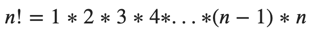

Факториал — это произведение всех натуральных чисел от 1 до заданного числа n, записывается как n! 
Факториал 0! равен 1 по определению. 

Факториал может вычисляться рекурсивно или итеративно.
В данной задаче реализуйте итеративный способ.

Факториал определяется для всех неотрицательных целых чисел следующим образом:

При решении нельзя пользоваться никакими уже реализованными решениями, которое сразу дают ответ.
Алгоритм должен быть реализован самостоятельно.
