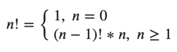

**Рекуррентная формула** - формула выражающая каждый член последовательности через **предыдущие** члены последовательности  
и **номер** текущего члена последовательности

Рекуррентная формула для факториала:

При решении нельзя пользоваться никакими уже реализованными решениями, которое сразу дают ответ.
Алгоритм должен быть реализован самостоятельно.
