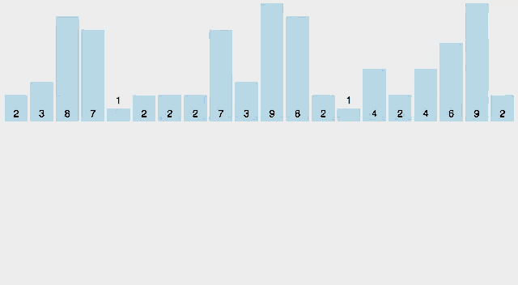

Сортировка подсчетами (Counting Sort) - это алгоритм сортировки, который использует подсчет количества каждого элемента в массиве и сортировку по вспомогательному массиву.

Отсортируйте массив целых не отрицательных чисел.  
Гарантируется, что минимальный элемент равен 0. Максимальный элемент может меняться.

При решении нельзя пользоваться никакими уже реализованными решениями, которое сразу дают ответ.
Алгоритм должен быть реализован самостоятельно.
