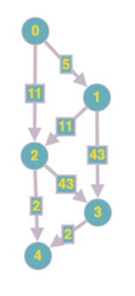

Решить задачу о платной лестнице с помощью графов. 
Мальчик подошел к платной лестнице.  
Чтобы наступить на любую ступеньку, нужно заплатить указанную на ней сумму.  
Мальчик умеет перешагивать на следующую ступеньку, либо перепрыгивать через ступеньку.  

Требуется узнать, какая наименьшая сумма понадобится мальчику, чтобы добраться до верхней ступеньки.
Гарантируется, что лестница состоит хотя бы из одной ступени.

Алгоритм:
1. Пусть каждая ступень это узел графа. 0 - ступень это земля, 1 - первая ступень, 2 - вторая ступень, n - последняя ступень.
2. Дуги между узлами это возможные ходы с конкретной ступени, например 0 -> 1, 0 -> 2 - то есть с земли можем пойти на первую или вторую ступень согласно условию.  
    Вес дуги — это стоимость, нужно заплатить, чтобы наступить на ступень.
3. Когда будет составлен граф со всеми узлами и дугами, то нужно запустить алгоритм, который найдет кратчайший по стоимости путь с земли до последней ступени.  
    Например, если стоимость ступеней равна (5, 11, 43, 2, 23, 43, 22, 12, 6, 8), то часть графа для первых 4 ступеней будет выглядеть как:
   